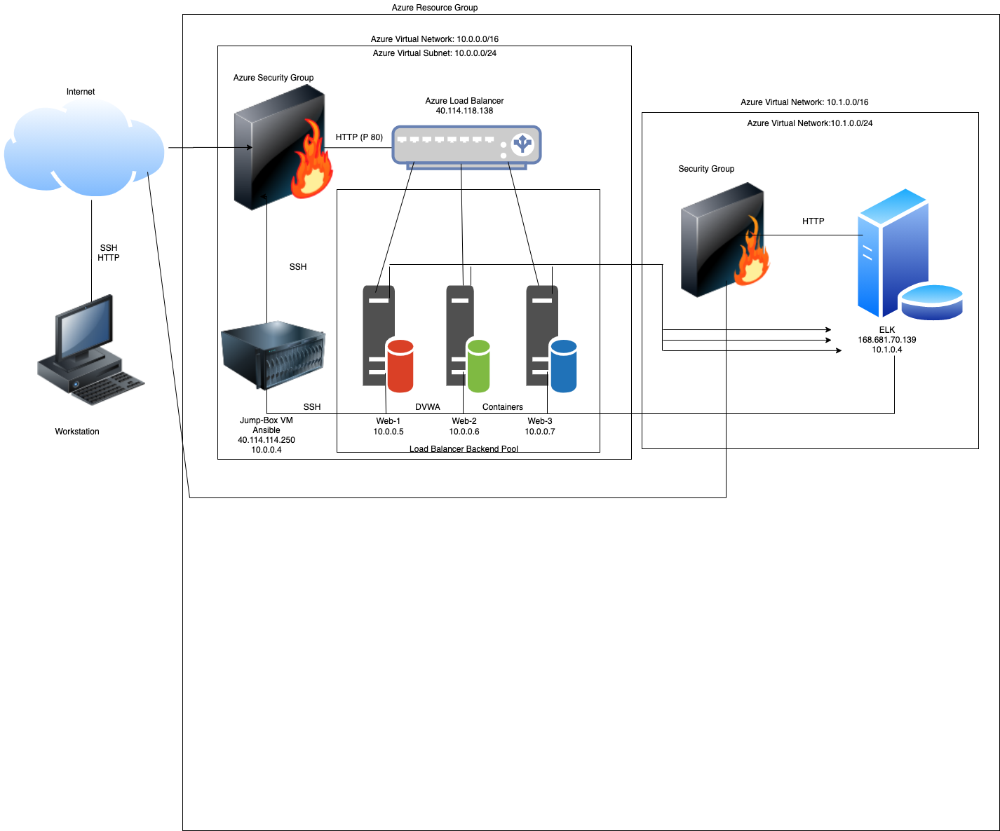

### Automated ELK Stack Deployment
##### The files in this repository were used to configure the network depicted below.

### Network Topology:

These files have been tested and used to generate a live ELK deployment on Azure. They can be used to either recreate the entire deployment pictured above. 

##### This document contains the following details:

###### Description of the Topology
Access Policies - network security groups 
ELK Configuration - where it sits in the network 
Beats in Use - metricbeat, filebeat and packetbeat
Machines Being Monitored - VM1, 2, & 3 (Docker containers running DVWA web servers)
How to Use the Ansible Build- Run the ansible playbooks to build the conatiners and start the servers
Description of the Topology - 

The main purpose of this network is to expose a load-balanced and monitored instance of DVWA, the D*mn Vulnerable Web Application.

Load balancing ensures that the application will be highly redundant, in addition to restricting access to the network.

What aspect of security do load balancers protect? (Availability) What is the advantage of a jump box ( Allows for more security by giving access to the network while still keeping internal machines private )

Integrating an ELK server allows users to easily monitor the vulnerable VMs for changes to the docker and system logs.

What does Filebeat watch for?  changes to the system logs
What does Metricbeat record?
The configuration details of each machine may be found below. Note: Use the Markdown Table Generator to add/remove values from the table.

Name	Function	IP Address	Operating System
Jump Box	Gateway	10.0.0.4	Linux
DVWA1			        10.0.0.7  Linux 
DVWA2		          10.0.0.8  Linux
ELKServer         10.1.0.4  Linux

Only the Jumpbox machine can accept connections from the Internet. 

Machines within the network can only be accessed by 10.0.0.4.

Which machine did you allow to access your ELK VM 10.0.0.4?
A summary of the access policies in place can be found in the table below.

Name	Publicly Accessible	Allowed IP Addresses
Jump Box	Yes   	10.0.0.4	
DVWA1		  No      10.0.0.7  
DVWA2		  No      10.0.0.8  
ELKServer Yes     10.1.0.4  
Ansible was used to automate configuration of the ELK machine. No configuration was performed manually, which is advantageous because...

What is the main advantage of automating configuration with Ansible?
Run templates on multiple machines simultaneously
The playbook implements the following tasks:
Gathering Facts ,Install docker.io, Install pip3, Install Docker python module, Use more memory, download and launch a docker elk container

In 3-5 bullets, explain the steps of the ELK installation play. E.g., install Docker; download image; etc. (Please see install_elk.yml file in the Ansible folder)
Configure Elk VM with Docker,
Install docker.io,
Install pip3,
Install Docker python module,
Increase virtual memory,
Use more memory,
download and launch a docker elk container.

#### Target Machines & Beats
This ELK server is configured to monitor the following machines:
DVWA1 and DVWA2

List the IP addresses of the machines you are monitoring
10.0.0.7 and 10.0.0.8

#### Specify which Beats you successfully installed
Filebeats and Metricbeats

These Beats allow us to collect the following information from each machine:
system logs and Docker logs

Which file do you update to make Ansible run the playbook on a specific machine? How do I specify which machine to install the ELK server on versus which to install Filebeat on? Hosts file specifies the internal IP addresses where the playbooks will run on. The hosts file contains multiple groups.
_Which URL do you navigate to in order to check that the ELK server is running? Public IP of the elk sever vm over port 5601.
